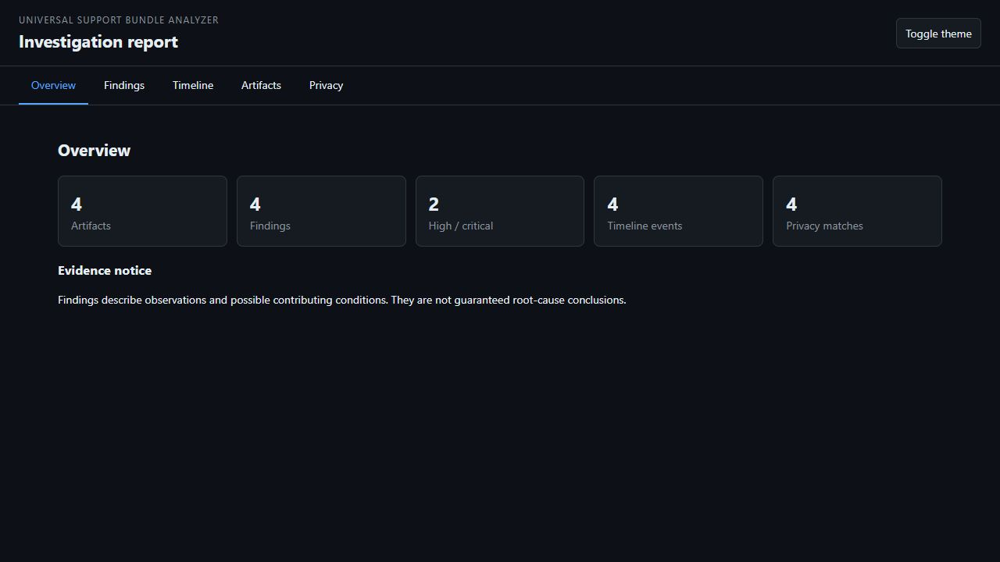
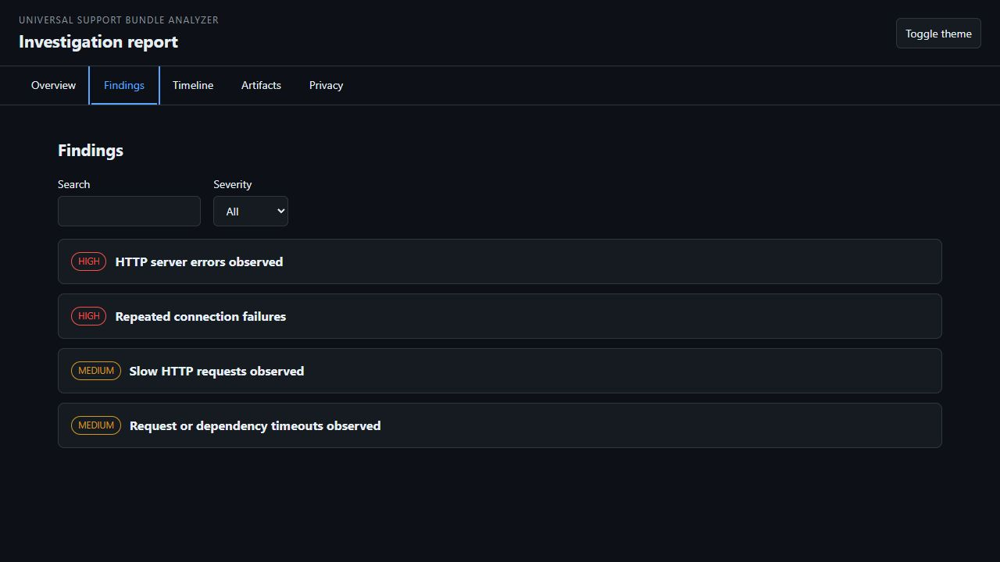
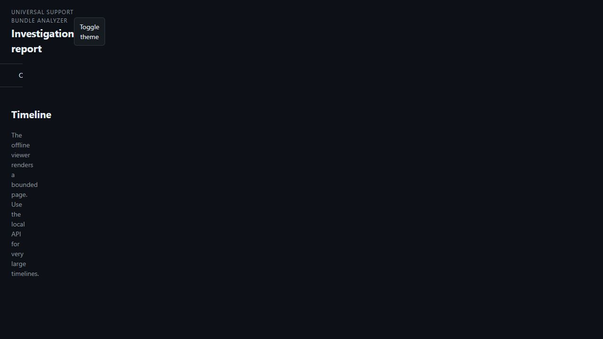
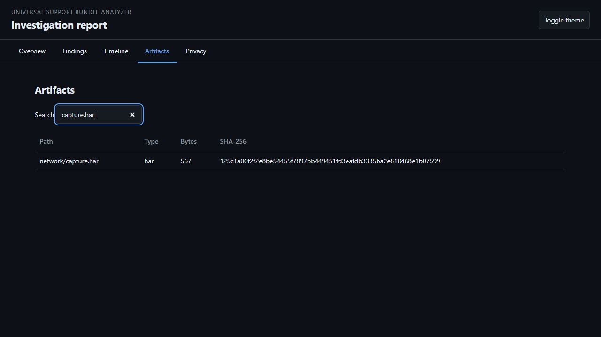
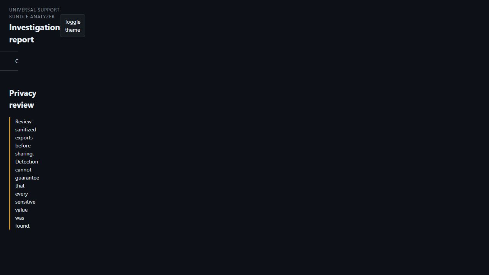
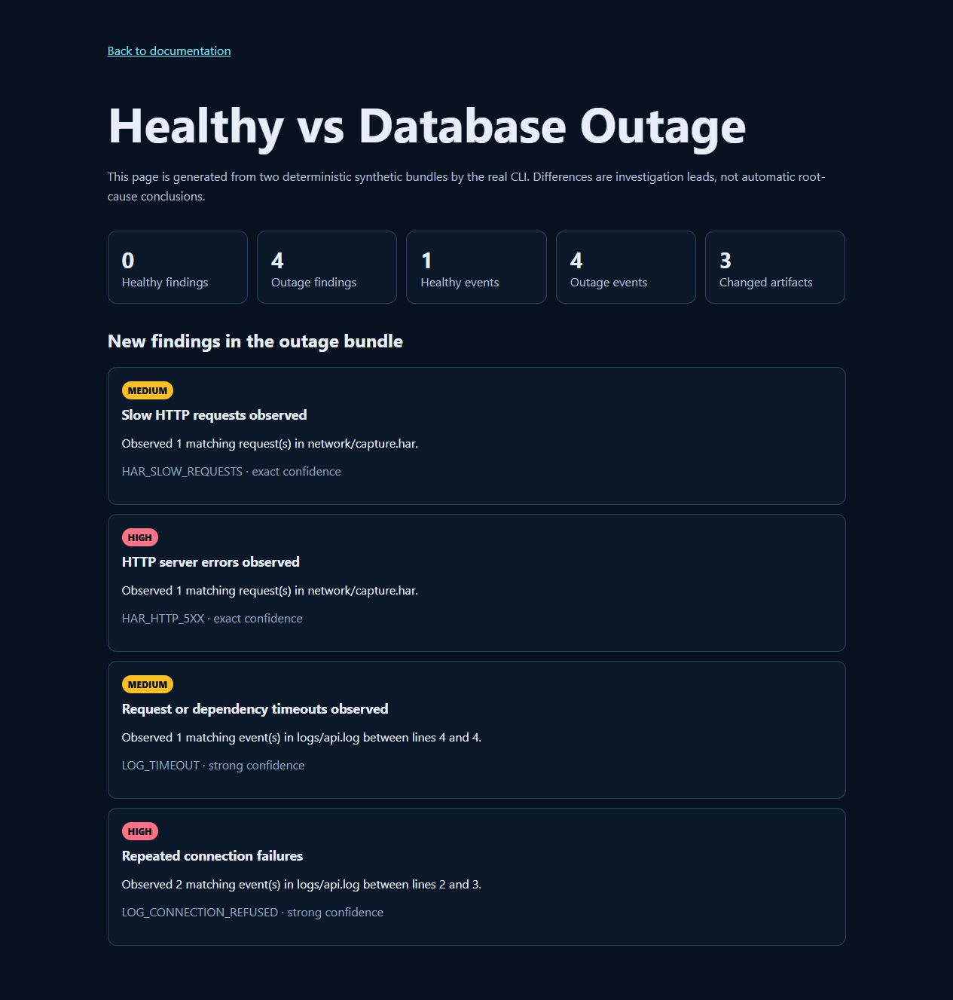
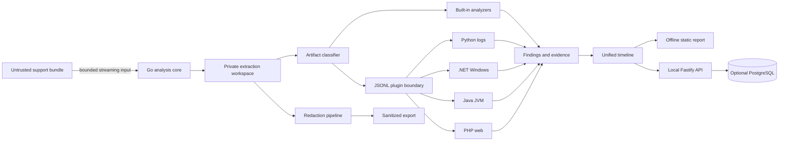

# Support Bundle Analyzer

[](https://github.com/German4341374/support-bundle-analyzer/actions/workflows/ci.yml)
[](https://github.com/German4341374/support-bundle-analyzer/actions/workflows/security.yml)
[](LICENSE)

Offline, privacy-first support bundle analyzer for logs, HAR files, Windows events, Kubernetes, Docker and application diagnostics. It safely extracts archives, inventories and hashes their contents, builds evidence-backed findings and a unified timeline, detects sensitive values, and produces a static report that works without a backend or network connection.



> **Security warning:** support bundles can contain credentials, personal data, private keys, and malicious archive structures. Run the analyzer on trusted infrastructure, keep workspaces private, and review every sanitized export before sharing it. Detection reduces risk; it cannot guarantee that all sensitive data was found.

## Why

Support engineers often receive a ZIP containing unrelated logs, HTTP traces, configuration snapshots, and platform diagnostics. Manual review is slow and inconsistent. Support Bundle Analyzer creates a reproducible investigation workspace while treating every byte in the bundle as untrusted data. It never executes bundle content and never sends it to an external service.

## Quick start

Requirements: Go 1.26 or newer. Node.js 24 and Python 3.12 are needed for the control plane and advanced log plugin.

```bash
git clone https://github.com/German4341374/support-bundle-analyzer.git
cd support-bundle-analyzer
go build -trimpath -o bin/support-bundle-analyzer ./apps/cli
./bin/support-bundle-analyzer generate-demo database-outage.zip
./bin/support-bundle-analyzer analyze database-outage.zip --output investigation --timezone UTC
```

Open `investigation/report/index.html`. It loads local assets only. To prepare a shareable copy:

```bash
./bin/support-bundle-analyzer redact investigation --profile strict --output sanitized-investigation
```

## What it analyzes

| Area | Runtime | Current capability |
|---|---|---|
| Secure ingestion and orchestration | Go | ZIP, TAR, TAR.GZ, TAR.BZ2, TAR.XZ and GZIP; traversal/link/duplicate/bomb limits; SHA-256 inventory |
| Logs and HAR | Go | error patterns, evidence grouping, HTTP failures, timings, timeline and secret/PII review |
| Advanced log intelligence | Python | streaming JSON/generic/gzip logs, fingerprints, bursts, correlation IDs and privacy counts |
| Windows diagnostics | .NET | safe Event XML parsing and evidence groups for operationally important event families |
| JVM diagnostics | Java | thread states, deadlock indicators, GC pauses, OOM evidence and safe heap-dump recognition |
| PHP/web diagnostics | PHP | fatal errors, resource limits, PHP-FPM pressure, upstream failures and repeated HTTP 5xx |
| Local control plane | TypeScript | Fastify API, bounded cursor pages, SSE progress, token-protected remote mode and metrics |
| Persistent server mode | PostgreSQL | versioned schema, constraints, full-text search and investigation-oriented indexes |

The built-in Go log and HAR analyzers are wired into the default pipeline. External language plugins implement protocol version 1 and can be run independently; automatic discovery/orchestration for every bundled plugin is tracked as post-0.1 work. See [project status](docs/project-status.md).

## Offline report

These screenshots were captured from the working report with the repository's synthetic database-outage fixture. The report has no external fonts, scripts, analytics, or network requests.

| Findings | Timeline |
|---|---|
|  |  |
| HAR artifact | Privacy review |
|  |  |

Try the live synthetic demo: [database-outage report](https://german4341374.github.io/support-bundle-analyzer/demo-report/) and [healthy-vs-outage comparison](https://german4341374.github.io/support-bundle-analyzer/comparison.html).



The comparison above was generated by the real CLI on 28 August 2026: the healthy bundle produced 0 findings and 1 timeline event; the outage bundle produced 4 findings and 4 timeline events, with 3 changed artifacts. Results are investigation leads rather than asserted root causes.

## Architecture



The core owns untrusted-file handling, resource limits, workspace integrity and process isolation. Plugins receive a versioned JSON Lines request and return bounded normalized records. This keeps language-specific parsing out of the trust-critical archive layer.

## Security model

- Bundle files are never sourced, imported, executed, or loaded as libraries.
- Extraction rejects absolute paths, path traversal, symlinks, hardlinks, device files, FIFOs, duplicate normalized paths, oversized entries and excessive compression ratios.
- Workspaces use private file permissions and an atomic staging-to-complete transition.
- The API binds to `127.0.0.1` by default. Non-loopback mode requires explicit opt-in and a bearer token.
- Static-report data is JSON encoded and Base64 transported; the viewer creates text nodes instead of injecting artifact HTML.
- Plugin processes use argv-based spawning, deadlines, output limits and crash isolation.
- Sanitization uses stable pseudonyms inside one export and excludes binary artifacts.

Read the [threat model](docs/security/threat-model.md), [privacy guide](docs/guides/redaction.md), and [security policy](SECURITY.md) before using real customer bundles.

## CLI

```text
support-bundle-analyzer analyze <archive> [--output DIR] [--timezone IANA] [--quiet] [--json]
support-bundle-analyzer redact <workspace> [--profile standard|strict] [--output DIR]
support-bundle-analyzer diff <baseline-workspace> <incident-workspace> [--output FILE]
support-bundle-analyzer report <workspace> [--output DIR]
support-bundle-analyzer generate-demo <output.zip> [--scenario database-outage|healthy]
support-bundle-analyzer version
```

Exit code `0` means success, `2` is command usage, `3` is a missing input, and `4` is an analysis failure. Error messages never include artifact contents.

## Local API

```bash
npm ci
npm run build
SBA_CORE_BINARY="$PWD/bin/support-bundle-analyzer" npm run dev
curl http://127.0.0.1:8080/health
curl -X POST http://127.0.0.1:8080/api/v1/analyses \
  -H 'content-type: application/json' \
  -d '{"inputPath":"./database-outage.zip"}'
```

The API accepts local paths only under `SBA_INPUT_ROOT`; it is not an unauthenticated upload service. Findings, timeline, and artifacts are cursor-paginated with a maximum page size of 200. Progress is streamed from `/api/v1/analyses/:id/events` as Server-Sent Events. `/health` and the minimal `/ready` endpoint remain public for container and Kubernetes probes; all analysis routes require the remote-mode bearer token. Per-IP rate limits protect the API, with a stricter configurable budget for analysis, redaction, and comparison operations.

## Docker Compose

Docker Desktop with WSL2 integration or Docker Engine on Linux is supported.

```bash
cp .env.example .env
# Replace both placeholder secrets in .env.
docker compose up --build --wait
curl http://127.0.0.1:8080/health
docker compose down
```

The API is published only on host loopback. PostgreSQL remains on an internal network and uses a named volume. The image runs as UID/GID 10001 with all Linux capabilities dropped. Compose development and Helm/Terraform examples are documented under [`deploy/`](deploy/).

## Development and verification

WSL2/Linux:

```bash
./scripts/bootstrap.sh
./scripts/verify.sh
```

Useful focused commands:

```bash
go test -race ./apps/... ./internal/...
npm run check && npm run build && npm audit --audit-level=high
python3 -m ruff check analyzers/log-intelligence-python
python3 -m mypy analyzers/log-intelligence-python/src
python3 -m pytest analyzers/log-intelligence-python
dotnet test analyzers/windows-diagnostics-analyzer/tests/WindowsDiagnosticsAnalyzer.Tests.csproj -c Release
mvn -B -f analyzers/jvm-diagnostics-analyzer/pom.xml verify
(cd analyzers/php-web-diagnostics-analyzer && composer check)
```

The CI matrix runs each runtime independently, performs archive adversarial tests, validates schemas and deployment manifests, builds the container, scans source and images, and uploads test/build artifacts. Exact local verification evidence is recorded in [project status](docs/project-status.md).

## Project layout

```text
apps/          Go CLI, TypeScript API, offline JavaScript report viewer
analyzers/     Python, C#, Java, and PHP protocol plugins
internal/      Go ingestion, classification, analysis, redaction and reporting
packages/      Versioned JSON Schemas and protocol contracts
database/      PostgreSQL migrations, seed, smoke test and query-plan templates
deploy/        Docker, Helm and Terraform deployment definitions
fixtures/      Synthetic, non-personal test material
docs/          Architecture, security, guides, reference and runbooks
scripts/       Bootstrap, verification, demo and kind smoke automation
```

## Troubleshooting

- `output path already exists`: choose a new directory. The analyzer deliberately refuses to overwrite an investigation.
- `ARCHIVE_PATH_TRAVERSAL` or `ARCHIVE_UNSAFE_ENTRY`: quarantine the bundle and ask the sender to regenerate it; do not manually extract it.
- no findings: this means no current rule matched, not that the system is healthy. Review artifacts and analyzer warnings.
- timestamps appear out of order: pass the correct IANA timezone for source timestamps without offsets and review clock-skew warnings.
- Docker API returns 401: use `Authorization: Bearer <SBA_ACCESS_TOKEN>` outside the public `/health` and `/ready` endpoints.

Detailed recovery steps are in [`docs/runbooks/`](docs/runbooks/).

## Limitations

- External polyglot plugins are implemented and tested independently but are not automatically discovered by the default Go pipeline yet.
- EVTX binary parsing is intentionally not included; export Event XML or use a mature dedicated EVTX tool.
- Kubernetes and Docker diagnostics currently receive generic log/config classification rather than full platform-specific correlation.
- Sanitized exports exclude binary artifacts, non-regular files, and text artifacts over 64 MiB; they cannot guarantee removal of every secret or personal identifier.
- The local API keeps active session metadata in memory in version 0.1; PostgreSQL persistence is schema-complete but not connected to every route.
- Performance depends on archive composition and storage. No universal throughput claim is made.

## Roadmap

Near-term work: plugin discovery and orchestration, resumable server sessions, Kubernetes/Docker rule packs, signed plugin manifests, SARIF export, richer compare views, browser E2E coverage and measured PostgreSQL query plans. See [ROADMAP.md](ROADMAP.md).

## Contributing

Issues and focused pull requests are welcome. Start with [CONTRIBUTING.md](CONTRIBUTING.md), follow Conventional Commits, and do not attach real support bundles to public issues. Security reports must follow [SECURITY.md](SECURITY.md).

## License

Apache License 2.0. See [LICENSE](LICENSE) and [NOTICE](NOTICE).
