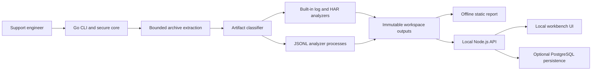
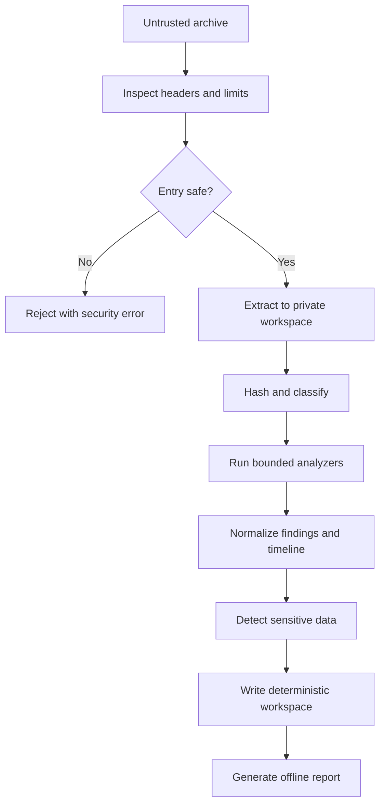

# Initial architecture design

## Goals

- Make the first useful path a local command that transforms a support archive into an investigation workspace.
- Keep unsafe bundle bytes separated from trusted application code.
- Allow analyzers written in different languages without coupling the Go core to their runtimes.
- Preserve evidence, provenance, ordering, and privacy decisions in versioned schemas.
- Offer a standalone offline report and an optional local API for large investigations.

## Components

## Analysis pipeline

## Trust boundaries

- Archive entries, filenames, metadata, and contents are untrusted.
- Analyzer stdout and stderr are untrusted and bounded.
- The generated report escapes every value before it reaches the DOM.
- The local API binds to loopback by default. Remote binding is an explicit authenticated mode.
- PostgreSQL is optional; the local workspace remains the portable source of evidence.

## Technology decisions

- Go owns secure ingestion, orchestration, deterministic workspace generation, diff, redaction, and the CLI.
- JSON Lines over stdin/stdout is the language-neutral analyzer boundary.
- TypeScript/Fastify exposes read-only workspace APIs and bounded pagination.
- Plain JavaScript powers the report that opens from disk without a server.
- PostgreSQL full-text search is used in persistent mode instead of a separate search cluster.
- Analyzer processes are used instead of a distributed queue for the local-first release.

## Risks

- Archive formats have inconsistent metadata and link semantics.
- Redaction is necessarily heuristic and cannot guarantee complete secret discovery.
- Polyglot packaging cannot be a true single executable; the core binary and full container distribution are separate products.
- Large timelines require pagination and eventual indexed storage rather than rendering all events at once.

## Assumptions

- The default user runs analysis on a trusted machine but handles untrusted bundle contents.
- External analyzers are installed from a trusted distribution or explicitly configured by the operator.
- The v0.1 core is useful without PostgreSQL, Kubernetes, or cloud infrastructure.

