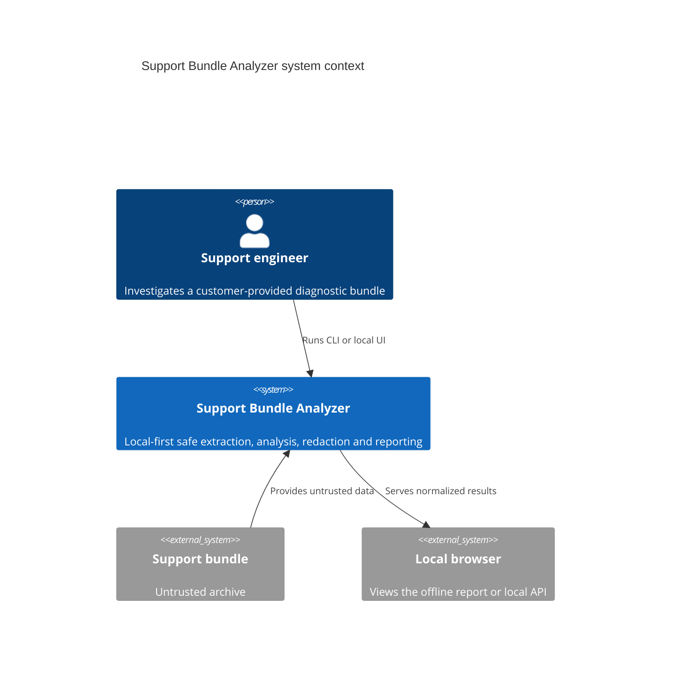
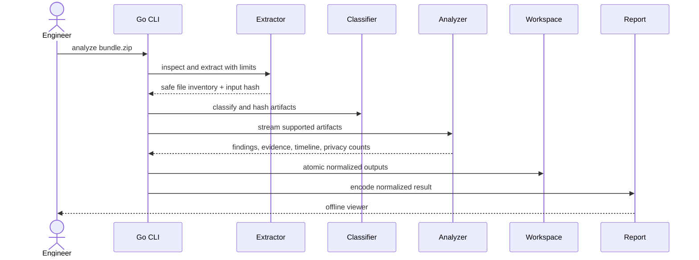
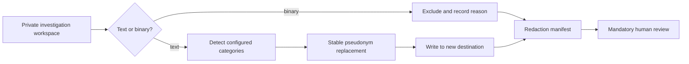

# System architecture

## Context

```mermaid
C4Context
    title Support Bundle Analyzer system context
    Person(engineer, "Support engineer", "Investigates a customer-provided diagnostic bundle")
    System(sba, "Support Bundle Analyzer", "Local-first safe extraction, analysis, redaction and reporting")
    System_Ext(bundle, "Support bundle", "Untrusted archive")
    System_Ext(browser, "Local browser", "Views the offline report or local API")
    Rel(engineer, sba, "Runs CLI or local UI")
    Rel(bundle, sba, "Provides untrusted data")
    Rel(sba, browser, "Serves normalized results")
```

## Analysis pipeline

```mermaid
sequenceDiagram
    actor Engineer
    participant CLI as Go CLI
    participant Extractor
    participant Classifier
    participant Analyzer
    participant Workspace
    participant Report
    Engineer->>CLI: analyze bundle.zip
    CLI->>Extractor: inspect and extract with limits
    Extractor-->>CLI: safe file inventory + input hash
    CLI->>Classifier: classify and hash artifacts
    CLI->>Analyzer: stream supported artifacts
    Analyzer-->>CLI: findings, evidence, timeline, privacy counts
    CLI->>Workspace: atomic normalized outputs
    CLI->>Report: encode normalized result
    Report-->>Engineer: offline viewer
```

## Redaction flow

```mermaid
flowchart LR
    A[Private investigation workspace] --> B{Text or binary?}
    B -->|binary| C[Exclude and record reason]
    B -->|text| D[Detect configured categories]
    D --> E[Stable pseudonym replacement]
    E --> F[Write to new destination]
    C --> G[Redaction manifest]
    F --> G
    G --> H[Mandatory human review]
```

Design trade-offs and ownership are recorded in the ADRs under `docs/decisions`.
