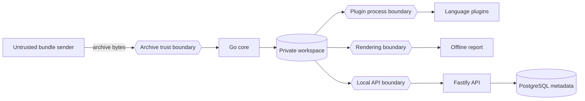

# Threat model

## Scope and assets

Protected assets are bundle confidentiality, workstation integrity, workspace integrity, report integrity, plugin execution integrity and API availability. Inputs, filenames, timestamps, encodings, structured fields and plugin output are untrusted.

## STRIDE review

| Threat | Example | Primary controls | Residual risk |
|---|---|---|---|
| Spoofing | unauthorized remote API caller | loopback default; explicit remote opt-in; bearer token; constant-time compare | host compromise or token disclosure |
| Tampering | traversal overwrites host files | normalized safe paths; extraction root check; no links/special files; exclusive create | parser or filesystem implementation defects |
| Repudiation | analysis result cannot be traced | bundle/artifact SHA-256; immutable manifest; structured audit schema | local files can be deleted by their owner |
| Information disclosure | secrets copied into a report | detection counts; strict redaction; binary exclusion; report warning | pattern matching cannot detect every secret or PII form |
| Denial of service | archive bomb or plugin flood | file/byte/ratio/count limits; bounded scanners; plugin timeout/output/finding limits | allowed maximums can still consume substantial resources |
| Elevation of privilege | executable content inside bundle | bundle content never executed; plugin argv spawn without a shell; fixed trusted plugin registry | a deliberately installed malicious plugin runs with analyzer privileges |

## High-priority abuse cases

### Archive traversal and Unicode confusion

Paths are converted to slash form, normalized to Unicode NFC, and rejected when absolute, drive-qualified, control-character-bearing, bidi-control-bearing, empty or traversal-based. Duplicate normalized case-folded paths are rejected. Symlinks, hardlinks, devices and FIFOs are rejected.

### Archive bombs

Limits cover entry count, declared and observed uncompressed bytes, single-file bytes, filename length and ZIP compression ratio. GZIP output is copied through a hard byte limit. Nested archives are indexed but not recursively expanded by the default pipeline.

### Malicious plugins

Only plugins installed by an operator are trusted to execute. The core does not create a shell command from bundle data. It enforces deadline, stdout/stderr and finding limits and treats invalid JSON or crashes as analyzer failure rather than session failure. OS-level sandboxing remains a deployment responsibility.

### XSS in logs and HAR

Report data is JSON serialized then Base64 encoded into a JavaScript assignment. The viewer renders untrusted fields with `textContent`. It does not evaluate bundle JavaScript or fetch remote assets. Content Security Policy should be added when the report is served over HTTP.

### SSRF

The core and static report make no outbound requests based on bundle content. The local API accepts a filesystem path under an operator-configured root; it does not fetch URLs.

### Temporary data

Workspace staging directories contain a random analysis identifier and use owner-only permissions where the platform supports them. Failed analysis staging data is removed. Successful workspaces persist until the operator's retention process removes them.

## Security assumptions

- The host OS and trusted analyzer binaries are not already compromised.
- The operator configures realistic limits for available disk and memory.
- Remote deployments terminate TLS and protect bearer tokens outside this repository.
- Sanitized output receives human review before external sharing.
